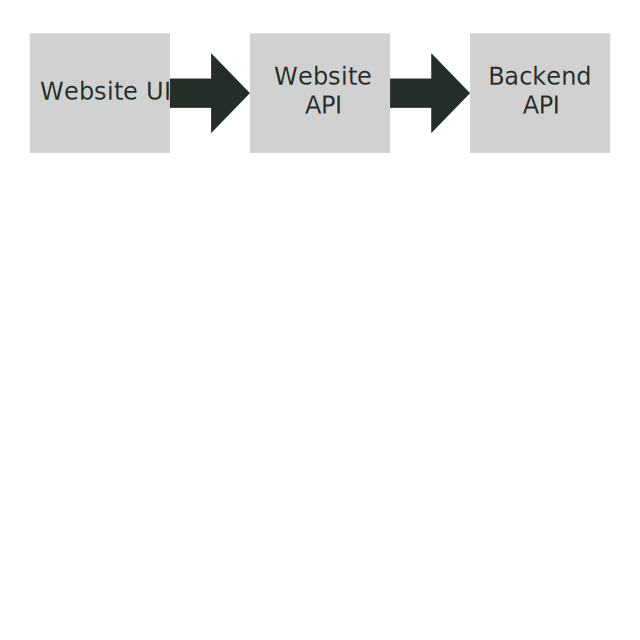

# Specmatic Sample Client Application

BFF = Backend For Frontend, the API invoked by the HTTP calls in the client HTML page (Website UI).

This project contains the product API, which is used by a small [ecommerce client application]((https://github.com/znsio/specmatic-order-ui).

Here is the [contract](https://github.com/znsio/specmatic-order-contracts/blob/main/in/specmatic/examples/store/api_order_v1.yaml) governing the interaction of the client with the product API.

The architecture diagram was created using the amazing free online SVG editor at [Vectr](https://vectr.com).